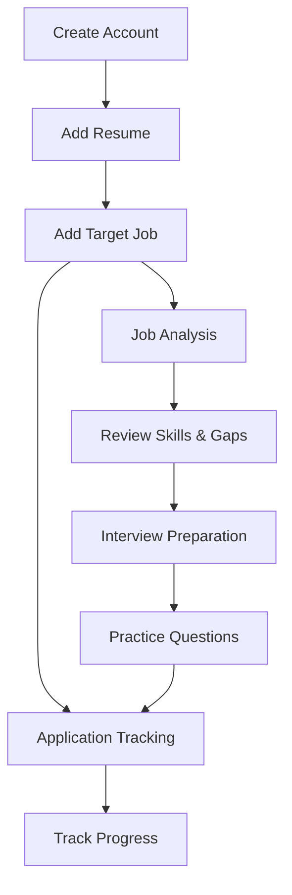
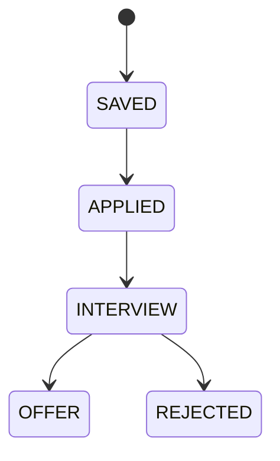
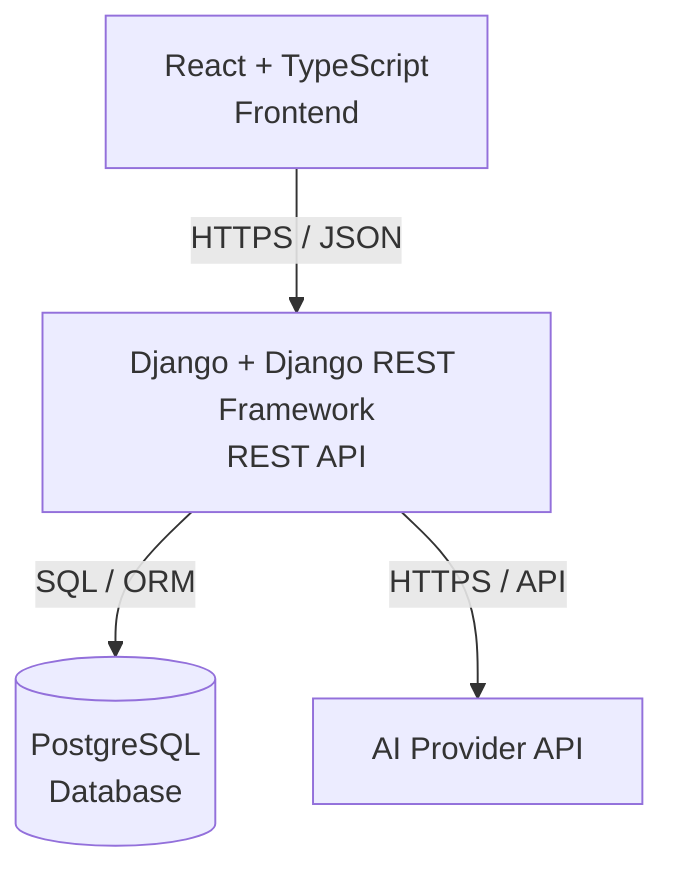
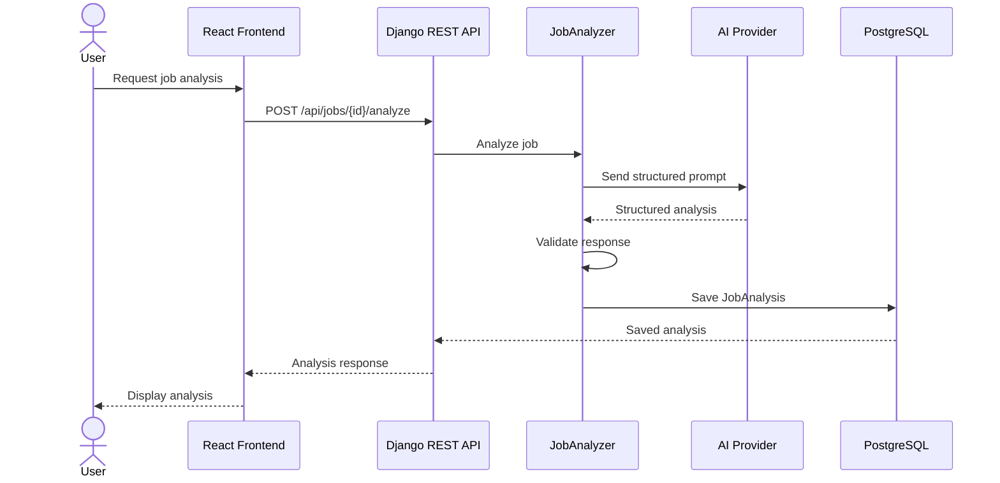
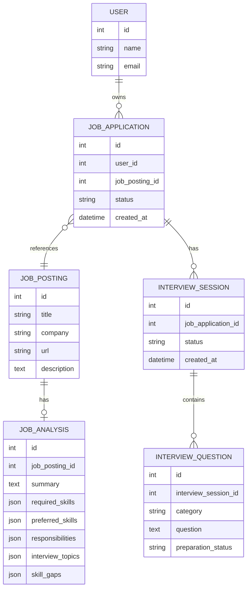
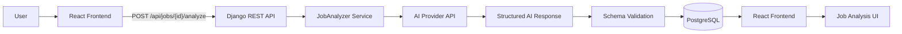
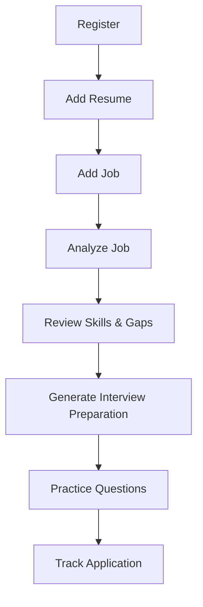

# CareerPilot

**CareerPilot** is an AI-powered job search and interview copilot that helps job seekers understand target roles, prepare for interviews, and track their applications.

> **Status:** MVP in development


## MVP

The CareerPilot MVP focuses on exactly three capabilities:

1. **Job Analysis**
2. **Interview Preparation**
3. **Application Tracking**

The goal is to build a small, reliable, production-ready application that demonstrates full-stack software engineering and practical AI integration.


## MVP User Journey



### 1. Create an Account

The user creates an account and signs in to CareerPilot.

### 2. Add a Resume

The user provides their resume so CareerPilot can use their skills and experience when analyzing target jobs.

### 3. Add a Target Job

The user creates a job workspace by providing:

- Job title
- Company
- Job description
- Job URL

### 4. Job Analysis

The user submits the job description for analysis.

CareerPilot identifies:

- Job summary
- Required skills
- Preferred skills
- Key responsibilities
- Likely interview topics
- Matching skills
- Potential skill gaps

### 5. Interview Preparation

The user generates interview preparation based on the target job and its analysis.

CareerPilot generates questions across relevant categories such as:

- Python
- Data Structures & Algorithms
- Backend development
- SQL and databases
- System design
- Behavioral questions
- Role-specific topics

The user can practice questions and track their preparation progress.

### 6. Application Tracking

The user tracks the application through the hiring process.



The user can update the application status and view their applications from the dashboard.

### MVP Outcome

For each target job, the user should have a single workspace containing:

- Resume information
- Job information
- AI-generated job analysis
- Identified skill gaps
- Targeted interview questions
- Interview preparation progress
- Application status

The MVP should help the user answer:

> **How well do I match this job, what should I prepare, and where am I in the application process?**


## MVP Features

### 1. Job Analysis

Analyze a target job description and produce structured information about the role.

**Input:**

* Resume
* Job description

**Output:**

- Job summary
- Required skills
- Preferred skills
- Responsibilities
- Interview topics
- Matching skills
- Skill gaps


### 2. Interview Preparation

Generate targeted interview preparation based on the target job and its analysis.

**Capabilities:**

- Generate interview questions
- Categorize questions
- Save questions
- Track preparation status
- Generate role-specific preparation material

**Question categories:**

- Python
- DSA
- Backend
- SQL / Databases
- System Design
- Behavioral
- Role-specific


### 3. Application Tracking

Track the user's job applications through the hiring process.

**Capabilities:**

- Save jobs
- Record application information
- Update application status
- View applications
- Filter applications by status
- Track basic application statistics

**Application statuses:**

- `SAVED`
- `APPLIED`
- `INTERVIEW`
- `OFFER`
- `REJECTED`


## Non-Goals

The following features are explicitly **out of scope for the MVP**.

### 1. Automated Job Discovery

CareerPilot will **not** automatically search LinkedIn, Indeed, company career pages, or other job boards for jobs.

Users will provide their target job manually.

### 2. Automated Job Applications

CareerPilot will **not** submit applications on behalf of users.

The user remains responsible for completing and submitting applications.

### 3. Full Resume Builder

CareerPilot will **not** attempt to become a complete resume/CV creation and formatting platform.

Resume information is an input to the MVP's job-analysis workflow.

### 4. Live AI Mock Interview With Voice

The MVP will **not** implement real-time voice conversations, speech recognition, avatars, or video-based interviews.

Interview preparation will initially focus on generated questions and preparation workflows.

### 5. Payments and Full Subscription Infrastructure

The MVP will **not** implement a complete production billing system, subscription management platform, or payment-processing workflow.

A pricing page may demonstrate the intended monetization model, but payment infrastructure is outside the initial MVP scope.


## Architecture

CareerPilot uses a simple client-server architecture.



### Components

| Component          | Responsibility                                              |
| ------------------ | ----------------------------------------------------------- |
| React + TypeScript | User interface and client-side application state            |
| Django + DRF       | REST API, authentication, authorization, and business logic |
| PostgreSQL         | Persistent application data                                 |
| AI Provider        | Job analysis and interview-preparation generation           |
| Docker             | Local development and deployment consistency                |
| GitHub Actions     | Automated testing and CI                                    |

### Job Analysis Request Flow



### Core Data Model



> **Note:** Resume management will initially remain minimal. A dedicated `Resume` entity will only be introduced if the MVP requires persistent resume management beyond the initial workflow.


## Request Flow

A typical job-analysis request follows this path:



The application will initially keep AI processing synchronous where practical. Background workers and queues will only be introduced if the MVP demonstrates a genuine need for asynchronous processing.


## Project Scope

The MVP is considered complete when a new user can:



The priority is **a small, deployed, reliable product**, not the number of features implemented.

## Development Principles

CareerPilot will be developed with the following principles:

- Keep the MVP intentionally small.
- Prefer simple architecture over premature abstraction.
- Validate all AI-generated structured output.
- Keep AI credentials on the backend.
- Enforce authentication and object-level authorization.
- Write automated tests for important business logic.
- Use AI coding tools to accelerate development, not replace understanding.
- Review AI-generated code before merging.
- Document important architectural decisions in `DECISIONS.md`.
- Document mistakes, lessons, and interview questions in `LEARNING_LOG.md`.
- Treat everything committed to the repository as potentially public.
- Never commit secrets, credentials, private user data, or sensitive configuration.
- Push meaningful changes to Git regularly.


## Planned Technology Stack

| Layer            | Technology                              |
| ---------------- | --------------------------------------- |
| Frontend         | React + TypeScript                      |
| Backend          | Python + Django + Django REST Framework |
| Database         | PostgreSQL                              |
| AI               | AI Provider API                         |
| Containerization | Docker                                  |
| CI/CD            | GitHub Actions                          |
| Version Control  | Git + GitHub                            |
| Deployment       | Cloud hosting                           |


## MVP Success Criteria

CareerPilot will be considered MVP-ready when:

- [ ] A user can create an account and authenticate.
- [ ] A user can add a resume.
- [ ] A user can create a target job.
- [ ] A user can analyze a job description using AI.
- [ ] AI output is validated against a defined schema.
- [ ] A user can view identified skills and skill gaps.
- [ ] A user can generate interview questions.
- [ ] A user can track interview-preparation progress.
- [ ] A user can create and update application records.
- [ ] A user can track application status.
- [ ] Protected resources enforce user-level authorization.
- [ ] Backend and frontend have automated tests.
- [ ] The application can run through Docker.
- [ ] CI runs automatically on pushes.
- [ ] The MVP is deployed to a production environment.
- [ ] No secrets are committed to the repository.
- [ ] The README documents setup, architecture, and the MVP workflow.


## Repository Structure

The initial project structure will follow this general organization:

```bash
career-pilot/
├── backend/
├── frontend/
├── docs/
├── .github/
│   └── workflows/
├── DECISIONS.md
├── LEARNING_LOG.md
├── README.md
├── .gitignore
└── LICENSE
```

The structure may evolve as implementation details become clearer, but new complexity should be justified by an actual project requirement.

## License

This project is licensed under the MIT License.
